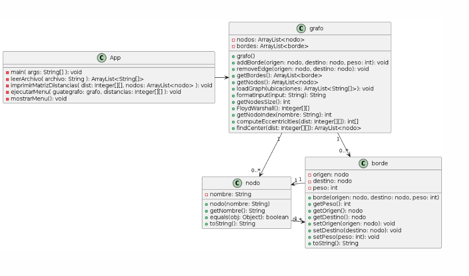

### Universidad del Valle de Guatemala
#### Facultad de Ingeniería
##### Departamento de Ciencias de la Computación

---

### Hoja de Trabajo No. 10 - Algoritmos y Estructura de Datos

#### Estudiante:
- Nombre: Diego Lopez
- Carnet: 23242
- Universidad: Universidad del Valle de Guatemala
- Fecha: 21 de mayo de 2024

---

### Descripción del Ejercicio

El ejercicio consiste en implementar un programa en Java que maneje grafos y aplique el algoritmo de Floyd para encontrar la ruta más corta entre cualquier par de nodos del grafo, así como para calcular el centro del grafo. El programa debe permitir leer el grafo desde un archivo de texto, permitir agregar o eliminar arcos desde la pantalla y calcular el centro del grafo.

---

### Implementación del Programa

El programa se divide en las siguientes clases:

1. `nodo`: Representa un nodo en el grafo.
2. `borde`: Representa un borde entre dos nodos en el grafo.
3. `grafo`: Representa el grafo en sí y contiene la lógica para manipularlo y aplicar el algoritmo de Floyd.
4. `App`: Clase principal que contiene el método `main` para ejecutar el programa.

El programa está diseñado para cumplir con los requisitos establecidos en la hoja de trabajo, incluyendo la lectura del grafo desde un archivo, la aplicación del algoritmo de Floyd, la manipulación del grafo y el cálculo del centro del mismo.

---

### Diagrama UML de Clases

A continuación se muestra el diagrama UML de clases que representa la estructura de las clases utilizadas en el programa:

---

### Ejecución del Programa

Para ejecutar el programa, se debe compilar y ejecutar la clase `App` desde la línea de comandos.

---

### Control de Versiones

El código del programa se encuentra bajo control de versiones utilizando Git. Se puede acceder al repositorio en el siguiente enlace: [Repositorio en GitHub](https://github.com/jcdiegolopez/hoja10)

---

### Pruebas Unitarias

Se han realizado pruebas unitarias utilizando JUnit para verificar el correcto funcionamiento de los métodos del grafo. Estas pruebas garantizan la integridad y robustez del programa.

---

